# DartMoQP: A Unified Framework for Mixed-Precision Quantization and Pruning of Mixture-of-Experts Models

DartMoQP is a Mixture-of-Experts (MoE)-native unified framework for mixed-precision quantization and structured pruning, operating at micro-expert granularity. It brings quantization and pruning into a single loss space for joint sensitivity modeling and globally optimal bit allocation via dynamic programming.

---

## Key Contributions

### Challenges Addressed

1. **Separation between quantization and pruning** — 0-bit loss cannot be reliably measured in the same loss space as quantization, causing methods to stubbornly assign 1-bit to trivial neurons at ultra-low bitwidths.
2. **Quantizer-dependent error geometry** — weight-space metrics lose discriminative power under vector quantizers like TurboQuant due to rotation-induced isotropization.

### Core Insights

1. **Log-Domain Quadratic Loss Law**
   - Across representative per-row and vector quantizers, quantization loss is well fit by a quadratic function in the logarithmic domain ($R^2 > 0.99$ across neurons, experts, and layers)
   - This is an **empirical high-precision approximation** valid in the practical bitwidth range, not an exact mathematical theorem (rate-distortion-theoretic motivation provided in the paper)
   - Enables extrapolation of 0-bit (pruning) loss without manual hyperparameters, unifying pruning and quantization in a single continuous loss space
   - A simple conservative clipping safeguard ($\alpha = 2.0$) handles edge-case units whose extrapolation falls below measured 1-bit loss

2. **Input Manifold-Aware Sensitivity**
   - For per-row quantizers (GPTQ): Hessian-aware loss already incorporates input calibration weighting, so weight-space MSE works well
   - For vector quantizers (TurboQuant): random rotation causes geometric isotropization, making weight MSE nearly uniform across neurons; an inner-product loss measured on the calibration input manifold restores sensitivity discrimination

3. **Quantizer-Agnostic Global DP Search**
   - Micro-expert granularity: neurons within each expert sorted by sensitivity and grouped into S micro-experts
   - Global ranking: all micro-experts ranked by importance (sensitivity × expert activation rate)
   - Monotonic DP search with non-increasing bit allocation constraint finds globally optimal assignment at target bpw
   - Time complexity: $O(TWK^2)$ where T = micro-expert count, W = bit budget, K = candidate bitwidths

4. **Seed Sensitivity Stabilization (Side Benefit)**
   - TurboQuant's random rotation introduces seed-dependent PPL fluctuation on some models
   - Mixed-precision allocation mitigates this as a side effect by protecting the high-sensitivity units that drive seed-induced variation
   - On DeepSeekMoE-v1, IPE-TQ-DP reduces C4 PPL range from 16.50–33.81 to 11.42–11.52 across 6 seeds

### Framework Architecture

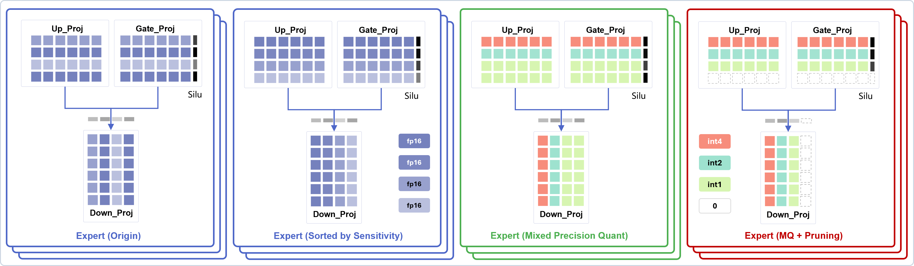
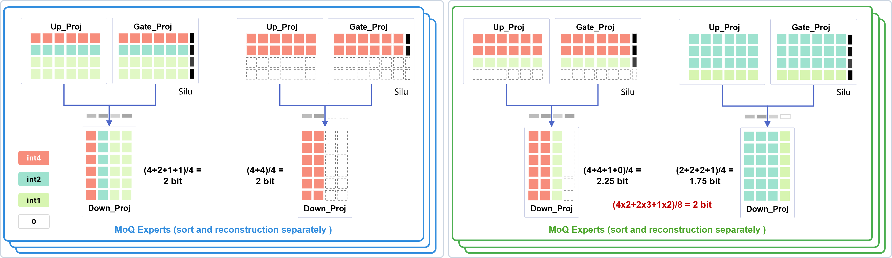


DartMoQP adopts a modular pipeline:
1. **Input manifold-aware multi-bit loss evaluation** per neuron
2. **0-bit loss extrapolation** via log-domain quadratic fitting
3. **Global DP search** for optimal mixed-precision allocation
4. **Deployment optimization** with expert merging and Triton kernels

---

## Log-Domain Quadratic Fit & 0-Bit Extrapolation

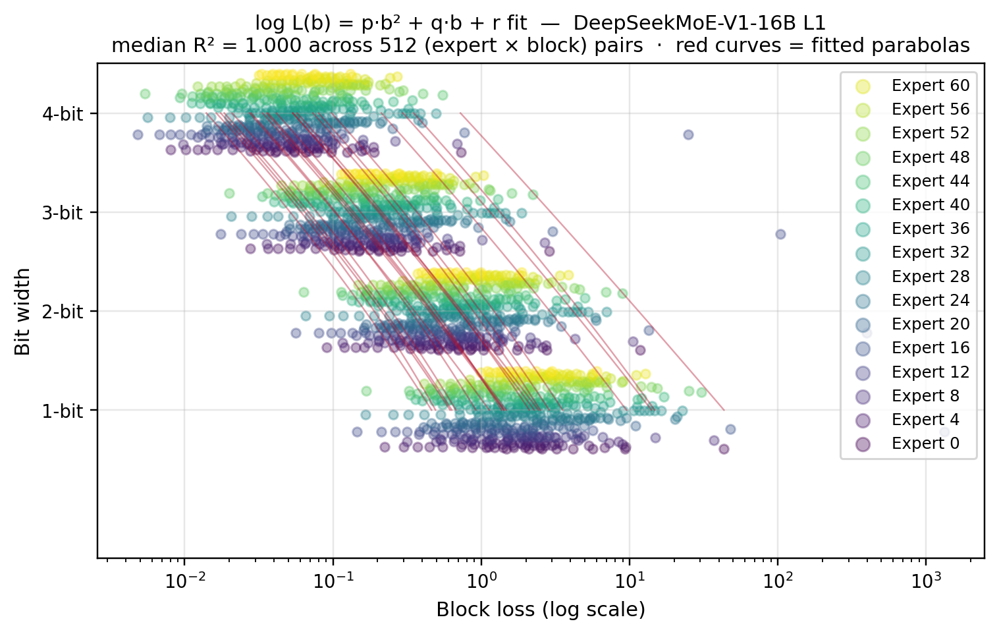

The central empirical finding is that quantization loss follows a quadratic form in the logarithmic domain:

$$\log L_i(b) = p_i b^2 + q_i b + r_i$$

where $b$ is bitwidth and $L_i(b)$ is the proxy loss of the $i$-th unit. This is not a mathematically exact identity but a **high-precision empirical approximation** — median $R^2$ values exceed 0.99 across all evaluated models and layers.

**Why it matters**: Extrapolating the quadratic curve to $b=0$ gives $\hat{L}_i(0) = \exp(r_i)$, placing pruning loss in the same continuous loss space as quantization. No manual pruning penalty coefficients are needed.

**Robustness**: A small fraction of low-sensitivity units (<5% under TurboQuant, <0.01% under GPTQ) have unreliable extrapolations; a simple conservative clip with $\alpha=2.0$ ensures robustness. For details and validation against direct zeroing loss, see the paper.

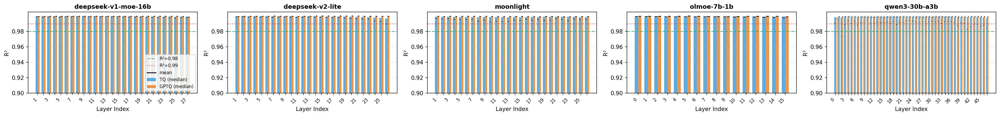
<div align="center"><em>Goodness-of-fit $R^2$ of log-domain quadratic fitting across five MoE models (median near 0.99)</em></div>

<div style="clear: both;"></div>

---

## Sensitivity Metrics for Different Quantizers

Different quantizers require different sensitivity metrics. DartMoQP provides a unified search interface with quantizer-matched loss functions.

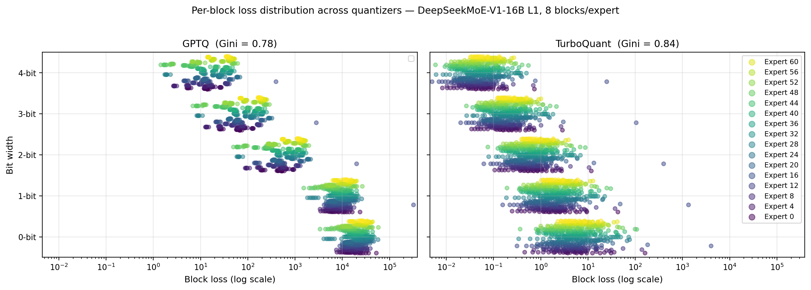

- **GPTQ (per-row)**: Uses Hessian-aware L2 loss $\mathcal{L}_{\text{GPTQ}} = (e_i^b)^\top C_X e_i^b$, consistent with local output error.
- **TurboQuant (vector)**: Uses L1 inner-product loss $\mathcal{L}_{\text{TQ}} = \mathbb{E}_{x\sim\mathcal{D}_{\text{calib}}}[|x^\top e_i^b|]$, measuring the projection of quantization error onto the calibration input distribution. This restores sensitivity discrimination after random rotation.

---

## Global Dynamic Programming Search

### Allocation Morphology

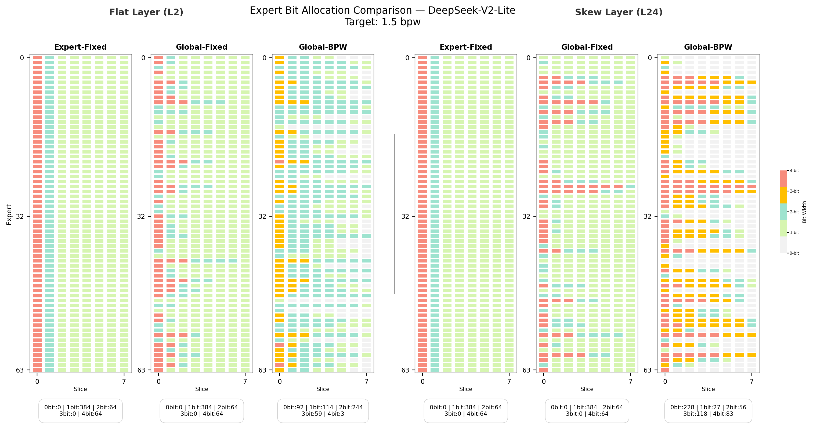

Uniform allocation assigns the same bitwidth to every micro-expert; DartMoQP's skewed allocation concentrates higher bitwidths in high-sensitivity regions while pruning (0-bit) low-sensitivity units — the structural signature of budget transfer.

### How It Works

1. **Within-expert neuron sorting** by sensitivity → micro-expert reconstruction
2. **Global micro-expert ranking** by sensitivity × expert activation rate
3. **DP search** with non-increasing bit allocation constraint
4. **Backtrack** to recover the optimal per-expert bit scheme

### Global vs. Layer-Wise Allocation

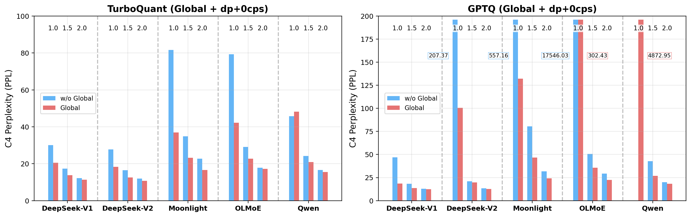

Cross-expert global DP reduces PPL by 0.05–0.10 and raises average downstream scores by 0.03–0.08 across all bitrates, with larger gains at <2 bpw.

---

## Results

DartMoQP achieves state-of-the-art performance across the full 0.5–3.0 bpw range on five mainstream MoE models:
- DeepSeekMoE-v1 (16B-A3B)
- DeepSeekMoE-v2-Lite (16B-A3B)
- Moonlight (16B-A3B)
- OLMoE-7B (7B-A1B)
- Qwen3-30B-A3B

### Perplexity vs. BPW (C4)


IPE-TQ-DP consistently outperforms all baselines, with the gap widening as bitwidth decreases.

### FP16 and Uniform 8-Bit Baselines

Reference points for the quantization results below. All attention, shared-FFN, and routed-expert linear projections are quantized; embeddings, norm layers, and LM head remain in FP16. Group size = 128.

| Model | Weight Setting | WikiText2 ↓ | C4 ↓ | Avg. ↑ | ARC-C ↑ | ARC-E ↑ | PIQA ↑ | BoolQ ↑ | WinoGrande ↑ | MNLI ↑ | HellaSwag ↑ | MMLU ↑ |
|-------|---------------|-------------|------|--------|---------|---------|-------|-------|--------------|--------|-------------|--------|
| DSMoEv1 | FP16 | 6.507 | 9.042 | 0.675 | 0.520 | 0.798 | 0.807 | 0.783 | 0.748 | 0.497 | 0.792 | 0.452 |
| DSMoEv1 | GPTQ-W8 | 6.513 | 9.050 | 0.674 | 0.528 | 0.796 | 0.804 | 0.782 | 0.748 | 0.495 | 0.793 | 0.449 |
| DSMoEv1 | TurboQuant-W8 | 6.512 | 9.051 | 0.673 | 0.520 | 0.794 | 0.807 | 0.779 | 0.744 | 0.496 | 0.794 | 0.448 |
| DSMoEv2 | FP16 | 6.307 | 8.905 | 0.705 | 0.567 | 0.837 | 0.821 | 0.790 | 0.758 | 0.487 | 0.796 | 0.582 |
| DSMoEv2 | GPTQ-W8 | 6.312 | 8.910 | 0.707 | 0.567 | 0.838 | 0.821 | 0.792 | 0.767 | 0.495 | 0.796 | 0.579 |
| DSMoEv2 | TurboQuant-W8 | 6.311 | 8.914 | 0.704 | 0.565 | 0.836 | 0.818 | 0.789 | 0.757 | 0.497 | 0.795 | 0.578 |
| Moonlight | FP16 | 7.121 | 10.361 | 0.739 | 0.632 | 0.859 | 0.822 | 0.822 | 0.751 | 0.520 | 0.808 | 0.700 |
| Moonlight | GPTQ-W8 | 7.121 | 10.362 | 0.740 | 0.636 | 0.860 | 0.824 | 0.823 | 0.747 | 0.519 | 0.809 | 0.698 |
| Moonlight | TurboQuant-W8 | 7.123 | 10.365 | 0.738 | 0.631 | 0.861 | 0.822 | 0.820 | 0.747 | 0.518 | 0.809 | 0.698 |
| OLMoE | FP16 | 7.489 | 10.467 | 0.678 | 0.555 | 0.823 | 0.818 | 0.750 | 0.714 | 0.452 | 0.783 | 0.527 |
| OLMoE | GPTQ-W8 | 7.495 | 10.469 | 0.678 | 0.552 | 0.821 | 0.819 | 0.753 | 0.718 | 0.453 | 0.784 | 0.526 |
| OLMoE | TurboQuant-W8 | 7.496 | 10.471 | 0.679 | 0.555 | 0.824 | 0.817 | 0.753 | 0.718 | 0.453 | 0.784 | 0.526 |
| Qwen3 | FP16 | 8.706 | 12.149 | 0.796 | 0.682 | 0.882 | 0.829 | 0.891 | 0.697 | 0.815 | 0.777 | 0.795 |
| Qwen3 | GPTQ-W8 | 8.718 | 12.164 | 0.796 | 0.681 | 0.883 | 0.831 | 0.893 | 0.696 | 0.815 | 0.775 | 0.795 |
| Qwen3 | TurboQuant-W8 | 8.728 | 12.170 | 0.795 | 0.675 | 0.881 | 0.831 | 0.889 | 0.699 | 0.815 | 0.776 | 0.794 |

*Downstream tasks use 5-shot evaluation. ARC-Challenge, ARC-Easy, PIQA, and HellaSwag report normalized accuracy; others report accuracy. Avg. = unweighted mean over 8 tasks.*

## Method Naming Overview

We evaluate several method combinations. To avoid confusion, here is a concise naming reference consistent with the paper:

| Method Name | Quantization Backend | Sensitivity Metric | Search Strategy | Description |
|-------------|---------------------|-------------------|-----------------|-------------|
| GPTQ-Origin | GPTQ | — | Uniform (fixed bit) | Standard per-row GPTQ, uniform precision across all experts |
| TQ-Origin | TurboQuant | — | Uniform (fixed bit) | Standard vector-quantized TurboQuant, uniform precision |
| CAMERA-GPTQ | GPTQ | Energy-based (CAMERA) | Expert-level static | CAMERA's energy ranking + GPTQ, no DP search, 2 bpw only (industrial baseline) |
| CAMERA-TQ | TurboQuant | Energy-based (CAMERA) | Expert-level static | CAMERA's energy ranking + TurboQuant, no DP search, 2 bpw only (industrial baseline) |
| GEMQ | GPTQ | GEMQ's metric | Expert-level mixed-precision | Expert-level mixed-precision baseline (ICML 2026) |
| CAMERA-DP | GPTQ / TurboQuant | Energy-based (CAMERA) | Global DP | CAMERA's energy ranking within our DP search framework (apples-to-apples metric ablation) |
| GPTQ-DP | GPTQ | Hessian-aware loss | Global DP | GPTQ backend with unified 0-bit modeling + global DP search |
| IPE-TQ-DP (ours) | TurboQuant | Inner-product error (input manifold-aware) | Global DP | **Full DartMoQP**: TurboQuant backend + IPE sensitivity + unified 0-bit + global DP |

**Key baseline categories**:
- *Uniform-precision baselines*: GPTQ-Origin, TQ-Origin (only integer bitwidths)
- *CAMERA static baselines*: CAMERA-GPTQ, CAMERA-TQ (2 bpw industrial reference)
- *Mixed-precision search baselines*: GEMQ, CAMERA-DP
- *Our methods*: GPTQ-DP, **IPE-TQ-DP**

---

### 1.0 bpw (raw weight bits)

| Model | Method | WikiText2 ↓ | C4 ↓ | Avg. ↑ | ARC-C ↑ | ARC-E ↑ | PIQA ↑ | BoolQ ↑ | Winogrande ↑ | MNLI ↑ | Hellaswag ↑ | MMLU ↑ |
|-------|--------|------------|-----|--------|---------|---------|-------|-------|-------------|--------|-------------|--------|
| DSMoEv1 | GPTQ-Origin | 132.710 | 566.143 | 0.351 | 0.261 | 0.257 | 0.503 | 0.378 | 0.526 | 0.355 | 0.257 | 0.269 |
| DSMoEv1 | TQ-Origin | 663.677 | 723.955 | 0.350 | 0.246 | 0.266 | 0.517 | 0.378 | 0.531 | 0.355 | 0.258 | 0.250 |
| DSMoEv1 | GEMQ | 61548916.0$^\dag$ | 139172736.0$^\dag$ | 0.380 | 0.266 | 0.248 | 0.508 | 0.621 | 0.515 | 0.355 | 0.267 | 0.263 |
| DSMoEv1 | CAMERA-DP | 278.704 | 573.556 | 0.347 | 0.245 | 0.256 | 0.519 | 0.379 | 0.506 | 0.363 | 0.271 | 0.235 |
| DSMoEv1 | GPTQ-DP | 10.878 | **18.561** | **0.523** | **0.375** | 0.650 | **0.693** | 0.629 | **0.622** | **0.400** | **0.552** | 0.266 |
| DSMoEv1 | IPE-TQ-DP | **9.962** | 20.576 | 0.521 | 0.374 | **0.677** | 0.661 | **0.691** | 0.617 | **0.400** | 0.497 | 0.253 |
| DSv2-Lite | GPTQ-Origin | 142.748 | 210.266 | 0.373 | 0.235 | 0.273 | 0.514 | 0.594 | 0.519 | 0.328 | 0.270 | 0.249 |
| DSv2-Lite | TQ-Origin | 35.779 | 49.428 | 0.386 | 0.220 | 0.341 | 0.554 | 0.570 | 0.486 | 0.347 | 0.316 | 0.252 |
| DSv2-Lite | GEMQ | 36.000 | 70.717 | 0.397 | 0.224 | 0.383 | 0.558 | **0.598** | 0.515 | 0.350 | 0.300 | 0.245 |
| DSv2-Lite | CAMERA-DP | 37.792 | 51.508 | 0.384 | 0.230 | 0.316 | 0.550 | 0.572 | 0.504 | 0.336 | 0.307 | 0.260 |
| DSv2-Lite | GPTQ-DP | 59.076 | 100.628 | 0.360 | 0.240 | 0.272 | 0.503 | 0.540 | 0.508 | 0.317 | 0.265 | 0.235 |
| DSv2-Lite | IPE-TQ-DP | **8.833** | **18.258** | **0.524** | **0.369** | **0.670** | **0.671** | 0.489 | **0.579** | **0.388** | **0.502** | **0.358** |
| Moonlight | GPTQ-Origin | 354.383 | 569.412 | 0.363 | 0.238 | 0.308 | 0.532 | 0.453 | 0.499 | 0.344 | 0.282 | 0.251 |
| Moonlight | TQ-Origin | 222.648 | 260.441 | 0.383 | 0.225 | 0.327 | 0.549 | 0.556 | 0.500 | 0.348 | 0.300 | 0.261 |
| Moonlight | GEMQ | 33.456 | 67.938 | 0.436 | 0.257 | 0.462 | 0.587 | **0.644** | 0.523 | **0.376** | 0.359 | 0.278 |
| Moonlight | CAMERA-DP | 249.477 | 333.547 | 0.384 | 0.218 | 0.340 | 0.552 | 0.556 | 0.501 | 0.354 | 0.296 | 0.254 |
| Moonlight | GPTQ-DP | 57.326 | 132.215 | 0.385 | 0.224 | 0.333 | 0.548 | 0.546 | 0.497 | 0.360 | 0.314 | 0.255 |
| Moonlight | IPE-TQ-DP | **14.871** | **36.872** | **0.480** | **0.325** | **0.608** | **0.634** | 0.638 | **0.550** | 0.335 | **0.452** | **0.296** |
| OLMoE | GPTQ-Origin | 33766.7 | 18911.7 | 0.355 | 0.250 | 0.274 | 0.516 | 0.467 | 0.496 | 0.321 | 0.263 | 0.251 |
| OLMoE | TQ-Origin | 16508.1 | 8896.2 | 0.365 | 0.249 | 0.282 | 0.522 | 0.538 | 0.506 | 0.321 | 0.260 | 0.243 |
| OLMoE | GEMQ | 193.196 | 675.897 | 0.380 | 0.212 | 0.364 | 0.552 | 0.542 | 0.505 | 0.327 | 0.277 | 0.265 |
| OLMoE | CAMERA-DP | 16753.1 | 8156.7 | 0.374 | 0.264 | 0.292 | 0.521 | 0.565 | 0.504 | 0.319 | 0.262 | 0.263 |
| OLMoE | GPTQ-DP | 162.274 | 302.431 | 0.385 | 0.216 | 0.335 | 0.536 | 0.590 | 0.523 | 0.348 | 0.298 | 0.236 |
| OLMoE | IPE-TQ-DP | **22.588** | **42.137** | **0.478** | **0.341** | **0.567** | **0.631** | **0.617** | **0.580** | **0.373** | **0.427** | **0.285** |
| Qwen3 | GPTQ-Origin | 4221.86 | 4872.95 | 0.350 | 0.249 | 0.269 | 0.517 | 0.411 | 0.507 | 0.338 | 0.264 | 0.245 |
| Qwen3 | TQ-Origin | 1514.08 | 1284.21 | 0.358 | 0.244 | 0.283 | 0.516 | 0.455 | 0.500 | 0.335 | 0.284 | 0.252 |
| Qwen3 | GEMQ | 179.958 | 221.594 | 0.397 | 0.245 | 0.370 | 0.576 | 0.554 | 0.531 | 0.348 | 0.303 | 0.251 |
| Qwen3 | CAMERA-DP | 1886.72 | 1422.79 | 0.355 | 0.230 | 0.303 | 0.527 | 0.417 | 0.513 | 0.336 | 0.268 | 0.243 |
| Qwen3 | GPTQ-DP | 982.384 | 1798.25 | 0.360 | 0.239 | 0.276 | 0.527 | 0.444 | 0.538 | 0.339 | 0.278 | 0.236 |
| Qwen3 | IPE-TQ-DP | **28.180** | **48.203** | **0.539** | **0.385** | **0.659** | **0.637** | **0.712** | **0.568** | **0.496** | **0.422** | **0.432** |

$^\dag$ *The GEMQ result on DSMoEv1 exhibits numerical divergence at this bitwidth due to position-dependent error accumulation from 1-bit expert quantization. Downstream tasks remain in a reasonable range because their short input contexts do not reach the divergence threshold. This is a boundary effect of operating at exactly 1 bpw with expert-level allocation and no intra-expert pruning — it disappears at 1.125 bpw. See the paper for detailed analysis.*

### 1.5 bpw (raw weight bits)

| Model | Method | WikiText2 ↓ | C4 ↓ | Avg. ↑ | ARC-C ↑ | ARC-E ↑ | PIQA ↑ | BoolQ ↑ | Winogrande ↑ | MNLI ↑ | Hellaswag ↑ | MMLU ↑ |
|-------|--------|------------|-----|--------|---------|---------|-------|-------|-------------|--------|-------------|--------|
| DSMoEv1 | GEMQ | 10.245 | 19.996 | 0.500 | 0.336 | 0.641 | 0.664 | 0.661 | 0.598 | 0.382 | 0.465 | 0.253 |
| DSMoEv1 | CAMERA-DP | 9.556 | 15.567 | 0.559 | 0.402 | 0.687 | 0.696 | 0.715 | **0.681** | 0.413 | 0.613 | 0.267 |
| DSMoEv1 | GPTQ-DP | 8.735 | **13.669** | 0.566 | 0.404 | 0.687 | **0.739** | 0.618 | 0.680 | **0.427** | **0.660** | **0.314** |
| DSMoEv1 | IPE-TQ-DP | **8.022** | 13.774 | **0.587** | **0.442** | **0.746** | 0.735 | **0.731** | 0.680 | 0.403 | 0.643 | **0.314** |
| DSv2-Lite | GEMQ | 13.348 | 31.328 | 0.457 | 0.282 | 0.563 | 0.638 | 0.621 | 0.533 | 0.352 | 0.407 | 0.257 |
| DSv2-Lite | CAMERA-DP | 8.982 | 14.218 | 0.600 | 0.439 | 0.721 | 0.715 | **0.772** | 0.640 | 0.442 | 0.638 | 0.433 |
| DSv2-Lite | GPTQ-DP | 11.119 | 19.646 | 0.485 | 0.339 | 0.605 | 0.636 | 0.585 | 0.562 | 0.375 | 0.495 | 0.281 |
| DSv2-Lite | IPE-TQ-DP | **7.323** | **12.610** | **0.614** | **0.475** | **0.767** | **0.729** | 0.724 | **0.656** | **0.464** | **0.657** | **0.439** |
| Moonlight | GEMQ | 21.403 | 55.076 | 0.463 | 0.294 | 0.516 | 0.596 | 0.651 | 0.553 | **0.410** | 0.405 | 0.282 |
| Moonlight | CAMERA-DP | 17.359 | 31.791 | 0.518 | 0.358 | 0.640 | 0.675 | **0.672** | **0.569** | 0.379 | 0.507 | 0.341 |
| Moonlight | GPTQ-DP | 19.319 | 46.681 | 0.449 | 0.277 | 0.488 | 0.605 | 0.636 | 0.546 | 0.323 | 0.428 | 0.289 |
| Moonlight | IPE-TQ-DP | **9.989** | **23.267** | **0.553** | **0.427** | **0.714** | **0.713** | 0.650 | 0.568 | 0.351 | **0.579** | **0.425** |
| OLMoE | GEMQ | 16.760 | 31.776 | 0.471 | 0.311 | 0.617 | 0.643 | 0.625 | 0.547 | 0.334 | 0.431 | 0.257 |
| OLMoE | CAMERA-DP | 33.461 | 46.650 | 0.517 | 0.375 | 0.611 | 0.683 | 0.654 | 0.586 | 0.400 | 0.541 | 0.287 |
| OLMoE | GPTQ-DP | 23.587 | 35.777 | 0.463 | 0.289 | 0.500 | 0.607 | 0.608 | 0.552 | 0.409 | 0.466 | 0.277 |
| OLMoE | IPE-TQ-DP | **15.104** | **22.778** | **0.575** | **0.437** | **0.692** | **0.706** | **0.694** | **0.664** | **0.435** | **0.593** | **0.380** |
| Qwen3 | GEMQ | **10.906** | 19.497 | 0.620 | 0.515 | 0.807 | 0.712 | 0.819 | 0.627 | 0.435 | 0.539 | 0.504 |
| Qwen3 | CAMERA-DP | 12.143 | **19.126** | 0.675 | 0.563 | 0.807 | 0.733 | **0.851** | 0.677 | 0.660 | 0.480 | 0.626 |
| Qwen3 | GPTQ-DP | 16.931 | 26.856 | 0.490 | 0.279 | 0.439 | 0.661 | 0.695 | 0.625 | 0.404 | 0.526 | 0.293 |
| Qwen3 | IPE-TQ-DP | 13.787 | 20.877 | **0.705** | **0.577** | **0.817** | **0.752** | 0.847 | **0.698** | **0.697** | **0.602** | **0.649** |

### 2.0 bpw (raw weight bits) — Industrial Mainstream Setting

| Model | Method | WikiText2 ↓ | C4 ↓ | Avg. ↑ | ARC-C ↑ | ARC-E ↑ | PIQA ↑ | BoolQ ↑ | Winogrande ↑ | MNLI ↑ | Hellaswag ↑ | MMLU ↑ |
|-------|--------|------------|-----|--------|---------|---------|-------|-------|-------------|--------|-------------|--------|
| DSMoEv1 | GPTQ-Origin | 8.617 | 12.911 | 0.583 | 0.427 | 0.722 | 0.755 | 0.666 | 0.695 | 0.355 | 0.720 | 0.324 |
| DSMoEv1 | TQ-Origin | 11.761 | 16.495 | 0.516 | 0.336 | 0.665 | 0.702 | 0.681 | 0.585 | 0.372 | 0.528 | 0.255 |
| DSMoEv1 | CAMERA-GPTQ | 8.272 | 12.695 | 0.592 | 0.433 | 0.722 | 0.752 | 0.688 | 0.679 | 0.414 | 0.700 | 0.347 |
| DSMoEv1 | CAMERA-TQ | 7.978 | 11.792 | 0.615 | 0.464 | 0.742 | 0.751 | **0.774** | 0.693 | **0.452** | 0.690 | 0.352 |
| DSMoEv1 | GEMQ | 7.224 | 11.965 | 0.597 | 0.454 | 0.768 | 0.770 | 0.700 | 0.696 | 0.396 | 0.669 | 0.323 |
| DSMoEv1 | CAMERA-DP | 7.804 | 11.856 | 0.624 | 0.464 | 0.750 | 0.763 | 0.764 | **0.712** | 0.450 | **0.729** | 0.358 |
| DSMoEv1 | GPTQ-DP | 7.994 | 12.304 | 0.603 | 0.437 | 0.747 | **0.779** | 0.666 | 0.702 | 0.415 | 0.728 | 0.355 |
| DSMoEv1 | IPE-TQ-DP | **7.214** | **11.302** | **0.627** | **0.480** | **0.775** | 0.777 | 0.754 | 0.709 | 0.434 | 0.716 | **0.374** |
| DSv2-Lite | GPTQ-Origin | 8.884 | 13.530 | 0.579 | 0.412 | 0.708 | 0.744 | 0.672 | 0.607 | 0.407 | 0.690 | 0.398 |
| DSv2-Lite | TQ-Origin | 7.958 | 11.025 | 0.651 | 0.480 | 0.784 | **0.781** | 0.760 | 0.704 | 0.455 | 0.730 | 0.515 |
| DSv2-Lite | CAMERA-GPTQ | 8.423 | 13.084 | 0.603 | 0.456 | 0.743 | 0.738 | 0.660 | 0.684 | 0.413 | 0.690 | 0.432 |
| DSv2-Lite | CAMERA-TQ | 7.396 | 10.952 | 0.656 | 0.487 | 0.781 | 0.770 | 0.785 | **0.725** | 0.469 | 0.730 | 0.504 |
| DSv2-Lite | GEMQ | 8.466 | 14.821 | 0.572 | 0.421 | 0.737 | 0.756 | 0.657 | 0.626 | 0.403 | 0.609 | 0.370 |
| DSv2-Lite | CAMERA-DP | 7.350 | 11.267 | 0.665 | 0.504 | 0.790 | 0.774 | **0.797** | 0.707 | 0.502 | **0.742** | 0.503 |
| DSv2-Lite | GPTQ-DP | 8.106 | 12.583 | 0.608 | 0.448 | 0.757 | 0.750 | 0.692 | 0.658 | 0.404 | 0.698 | 0.456 |
| DSv2-Lite | IPE-TQ-DP | **6.778** | **10.691** | **0.667** | **0.516** | **0.806** | 0.780 | 0.781 | 0.694 | **0.514** | 0.732 | **0.516** |
| Moonlight | GPTQ-Origin | 14.142 | 31.466 | 0.473 | 0.342 | 0.598 | 0.622 | 0.546 | 0.549 | 0.366 | 0.487 | 0.271 |
| Moonlight | TQ-Origin | 15.558 | 23.361 | 0.606 | 0.457 | 0.740 | 0.724 | 0.734 | 0.588 | 0.438 | 0.612 | 0.555 |
| Moonlight | CAMERA-GPTQ | 11.292 | 26.927 | 0.486 | 0.374 | 0.642 | 0.639 | 0.518 | 0.568 | 0.365 | 0.499 | 0.286 |
| Moonlight | CAMERA-TQ | 11.606 | 20.794 | 0.615 | 0.475 | **0.757** | 0.737 | **0.738** | 0.594 | 0.425 | 0.630 | **0.565** |
| Moonlight | GEMQ | 10.632 | 31.680 | 0.529 | 0.378 | 0.664 | 0.669 | 0.699 | 0.550 | 0.390 | 0.513 | 0.371 |
| Moonlight | CAMERA-DP | 10.357 | 20.762 | 0.607 | 0.468 | 0.747 | 0.733 | 0.734 | 0.594 | 0.428 | 0.628 | 0.526 |
| Moonlight | GPTQ-DP | 10.173 | 24.141 | 0.524 | 0.381 | 0.654 | 0.660 | 0.644 | 0.542 | 0.394 | 0.530 | 0.385 |
| Moonlight | IPE-TQ-DP | **8.022** | **16.589** | **0.620** | **0.514** | 0.784 | 0.735 | 0.678 | **0.624** | **0.439** | **0.651** | 0.532 |
| OLMoE | GPTQ-Origin | 20.790 | 29.033 | 0.529 | 0.377 | 0.612 | 0.681 | 0.628 | 0.571 | 0.421 | 0.607 | 0.336 |
| OLMoE | TQ-Origin | 15.123 | 17.788 | **0.651** | 0.495 | **0.757** | **0.771** | **0.777** | 0.669 | **0.558** | 0.716 | 0.469 |
| OLMoE | CAMERA-GPTQ | 18.450 | 26.905 | 0.544 | 0.388 | 0.616 | 0.685 | 0.661 | 0.578 | 0.445 | 0.613 | 0.367 |
| OLMoE | CAMERA-TQ | 14.726 | 18.834 | 0.637 | 0.493 | 0.741 | 0.761 | 0.755 | **0.681** | 0.471 | **0.717** | **0.480** |
| OLMoE | GEMQ | **10.497** | 17.226 | 0.545 | 0.439 | 0.721 | 0.732 | 0.629 | 0.626 | 0.328 | 0.580 | 0.301 |
| OLMoE | CAMERA-DP | 17.284 | 22.748 | 0.613 | 0.468 | 0.734 | 0.721 | 0.748 | 0.648 | 0.496 | 0.682 | 0.410 |
| OLMoE | GPTQ-DP | 15.547 | 22.333 | 0.558 | 0.409 | 0.646 | 0.687 | 0.681 | 0.613 | 0.427 | 0.620 | 0.383 |
| OLMoE | IPE-TQ-DP | 12.202 | **17.190** | 0.634 | **0.497** | 0.748 | 0.762 | 0.737 | 0.667 | 0.515 | 0.700 | **0.448** |
| Qwen3 | GPTQ-Origin | 13.045 | 19.989 | 0.555 | 0.373 | 0.612 | 0.709 | 0.741 | 0.628 | 0.453 | 0.630 | 0.293 |
| Qwen3 | TQ-Origin | 15.561 | 19.571 | 0.733 | 0.619 | 0.838 | 0.768 | 0.876 | 0.676 | 0.724 | 0.650 | 0.715 |
| Qwen3 | CAMERA-GPTQ | 11.685 | 18.581 | 0.553 | 0.387 | 0.633 | 0.729 | 0.679 | 0.665 | 0.385 | 0.670 | 0.278 |
| Qwen3 | CAMERA-TQ | 10.933 | 15.288 | 0.746 | 0.619 | 0.845 | 0.783 | 0.872 | 0.696 | 0.723 | 0.690 | 0.736 |
| Qwen3 | GEMQ | **9.499** | **14.040** | 0.715 | 0.610 | 0.843 | 0.791 | 0.852 | 0.695 | 0.562 | 0.711 | 0.659 |
| Qwen3 | CAMERA-DP | 10.330 | 14.974 | 0.746 | **0.660** | **0.862** | **0.798** | **0.883** | **0.700** | **0.788** | 0.537 | 0.742 |
| Qwen3 | GPTQ-DP | 11.644 | 18.151 | 0.635 | 0.471 | 0.729 | 0.737 | 0.820 | 0.680 | 0.578 | 0.677 | 0.387 |
| Qwen3 | IPE-TQ-DP | 10.882 | 15.509 | **0.757** | 0.638 | 0.855 | 0.789 | 0.880 | 0.699 | 0.698 | **0.737** | **0.763** |

### 0.5 bpw and 0.75 bpw Results

Refer to the paper for detailed results at ultra-low bitrates (0.5 and 0.75 bpw), where DartMoQP's unified pruning-quantization framework delivers the most dramatic improvements over baselines.

---

## Ablation Studies

### Unified 0-Bit Pruning

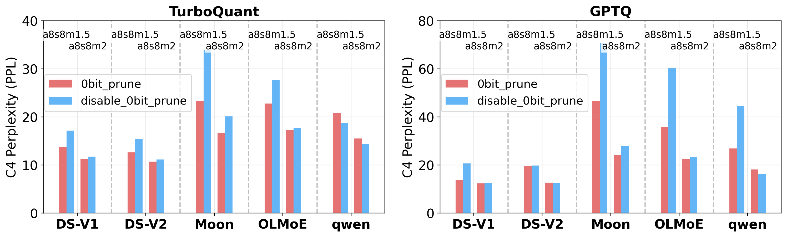

Disabling 0-bit pruning increases C4 PPL by 15–30% at 0.5–1.5 bpw. The benefit is bitrate-dependent: at ultra-low bitrates, pruning frees weight bits for critical neurons and eliminates quantization metadata for pruned units, compounding the effective budget gain.

### Input Manifold-Aware Loss

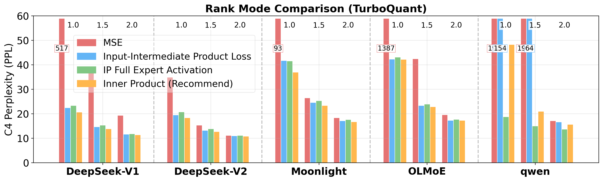

Comparing sensitivity metrics under TurboQuant: replacing weight MSE with inner-product metric improves sensitivity distinguishability dramatically, raising average downstream scores by 0.15–0.25 at 1 bpw.

### Micro-Expert Granularity

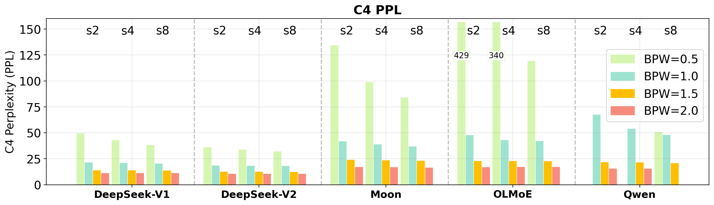

Finer granularity consistently yields lower PPL, confirming neuron sensitivity non-uniformity within experts. 8 micro-experts per expert provides the best accuracy–efficiency trade-off.

### Seed Sensitivity Stabilization


**Model**: DeepSeekMoE-v1, 2.0 raw bpw.

| Seed | Fixed-bit TQ (2 slices) | | Fixed-bit TQ (8 slices) | | IPE-TQ-DP (ours) | |
|------|------------------------|--|------------------------|--|-------------------|--|
| | WikiText2 ↓ | C4 ↓ | WikiText2 ↓ | C4 ↓ | WikiText2 ↓ | C4 ↓ |
| 0 | 24.30 | 33.81 | 23.94 | 33.59 | 7.33 | 11.44 |
| 42 | 11.76 | 16.50 | 11.62 | 16.67 | 7.28 | 11.46 |
| 84 | 13.47 | 22.13 | 13.32 | 22.09 | 7.35 | 11.47 |
| 126 | 15.61 | 23.11 | 15.65 | 23.04 | 7.30 | 11.42 |
| 168 | 21.98 | 32.43 | 21.30 | 32.16 | 7.32 | 11.45 |
| 210 | 11.72 | 18.98 | 11.61 | 18.72 | 7.32 | 11.48 |

IPE-TQ-DP reduces C4 PPL range from 16.50–33.81 to 11.42–11.52 across 6 seeds by protecting the high-sensitivity units that drive seed-induced variation. This effect is strongest on models where baseline fluctuation is large; on models with more uniform sensitivity distributions, the primary benefit is accuracy improvement.

---

## Calibration Dataset

All experiments use the **Wikipedia** calibration dataset, which is the de facto standard in the LLM quantization literature (GPTQ, AWQ, etc.), enabling direct comparison with published baselines.

**Role of calibration data across quantizer paradigms**:
- **GPTQ**: Strong dependence — calibration activations construct the Hessian and guide per-weight quantization with error compensation
- **IPE-TQ (DartMoQP)**: Moderate dependence — quantization itself is data-agnostic, but calibration data estimates neuron sensitivity via inner-product distortion, indirectly affecting ranking and allocation
- **Pure TurboQuant**: Data-agnostic — final weights depend only on original weights, random rotation matrix, and codebook

Evaluation is performed on C4 and downstream benchmarks that do not overlap with the calibration set, avoiding validation data leakage.

---

## Industrial Deployment

### Expert Merging and Memory Layout

The DP search produces structurally regular allocations: within each expert, neurons are sorted by sensitivity with non-increasing bitwidths. Micro-experts of the same bitwidth are merged into contiguous matrix blocks — zero impact on quantization accuracy, only storage reorganization. Pruned (0-bit) units are removed entirely.

### Triton Kernel Implementation

We have implemented a production-grade mixed-precision inference kernel based on Triton. The pipeline follows: scheme retrieval → expert merging → quantization → kernel execution.

**3D parallelization strategy**:
1. Different bitwidth groups within an expert → parallel scheduling
2. Rotation groups within each bitwidth level → further parallelization
3. GEMM operations within each rotation group → fine-grained parallelism

This design maximizes hardware utilization under the mixed-bitwidth constraint. The full inference code, including Triton kernel implementations and the expert-merging dispatcher, is provided for reproducibility.

---

## Visualization and Analysis

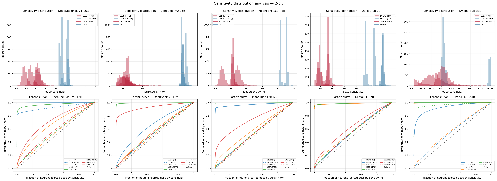


DartMoQP includes extensive visualization modules in the `viz/` directory. See the [Visualization Tools](#visualization-tools) section below for details.

---

## Installation

### Prerequisites

```bash
conda env create -f environment.yml
conda activate dartmoq
```

### Requirements

- Python 3.8+
- PyTorch 2.0+
- CUDA 11.8+
- Transformers
- Datasets
- NumPy
- Matplotlib

### Hardware

- **GPU**: NVIDIA RTX 5090 (48GB VRAM) or equivalent
- Qwen3-30B-A3B quantization: ~2.5 hours on a single RTX 5090
- Layer-wise quantization with intermediate memory release enables large models on consumer GPUs

---

## Usage

### Basic Command

```bash
python run_dartmoq.py \
    <model_path> \
    <dataset> \
    [--slices N] \
    [--nsamples N] \
    [--rank-mode MODE] \
    [--quant-scheme SCHEME] \
    [--quantmode {gptq,turboquant}] \
    [--eval-zero] \
    [--save-model] \
    [--standby-layer-cpu] \
    [--sequential-eval]
```

### Arguments

| Argument | Description | Default |
|----------|-------------|---------|
| `model` | Path to HuggingFace model checkpoint | **Required** |
| `dataset` | Calibration dataset: `wikitext2`, `ptb`, or `c4` | **Required** |
| `--seed` | Random seed for calibration sampling | 42 |
| `--nsamples` | Number of calibration samples | 128 |
| `--slices` | Number of micro-experts per expert (S) | 1 |
| `--rank-mode` | Neuron ranking mode for expert reordering | None |
| `--quant-scheme` | Quantization scheme (fixed or global DP) | None |
| `--quantmode` | Quantization algorithm: `gptq` or `turboquant` | `turboquant` |
| `--eval-zero` | Enable zero-shot task evaluation | False |
| `--save-model` | Save quantized model to disk | False |
| `--standby-layer-cpu` | CPU standby mode for large models (loads to CPU, moves layers to GPU one-by-one) | False |
| `--sequential-eval` | Sequential PPL evaluation (layers on CPU, moved to GPU one-by-one) | False |
| `--no-use-hybrid-moe` | Disable hybrid MoE structure, use original experts | False |
| `--disable-0bit-compensation` | Disable 0bit overhead compensation | False |
| `--disable-0bit-prune` | Disable 0bit in DP search (only 1-4 bits, no pruning) | False |

### Rank Modes (`--rank-mode`)

#### Activation-Based Modes

| Mode | Description | Best For |
|------|-------------|----------|
| `expert_activation` | Rank by activation frequency | Baseline comparison |
| `energy` | Rank by energy contribution (CAMERA metric, for comparison) | Baseline comparison |
| `random` | Random ordering | Baseline comparison |
| `neuron_index` | Original neuron index order | Baseline comparison |

#### GPTQ-Specific

| Mode | Description | Best For |
|------|-------------|----------|
| `gptq_quant_outlier` | Rank by GPTQ Hessian-aware quantization loss | **GPTQ quantization** |

#### TurboQuant-Specific

| Mode | Description | Best For |
|------|-------------|----------|
| `turboquant_innerproduct` | Inner product loss in activation space | **Recommended for TurboQuant** |
| `turboquant_mse` | Pure weight-space MSE (no activation weighting) | Ablation only — not recommended |
| `turboquant_iipl` | Input-Intermediate Product Loss | Alternative |
| `turboquant_diagonal` | Diagonal Hessian approximation | Computationally constrained |
| `turboquant_hessian` | Full Hessian computation | Highest accuracy (slower) |
| `turboquant_qjl_sensitivity` | Quantized Johnson-Lindenstrauss sensitivity | Theoretical exploration |

### Quantization Schemes (`--quant-scheme`)

#### Fixed Bit Schemes

Format: `a{A}s{S}m{BIT_STRING}` — allocation for each slice (length must equal `--slices`).

Examples:
- `a8s8m22222222`: uniform 2-bit routed experts (2.0 bpw excluding overhead)
- `a8s8m44332211`: decreasing from 4 to 1 bit (2.5 bpw average)

#### Global Dynamic Programming Schemes

Format: `global-bpw-a{A}s{S}m{BPW}` — global DP with monotonic non-increasing allocation across all experts.

- `BPW`: target average bits per weight for routed experts (can be fractional)

**Important**: bpw values refer to weight bits only, not including quantization parameter overhead:
- GPTQ: ~0.25 bpw overhead (groupsize=128)
- TurboQuant: ~0.252 bpw overhead

All methods use groupsize=128. Actual total bpw ≈ `target_bpw + 0.25` (GPTQ) or `target_bpw + 0.252` (TurboQuant).

#### How Global DP Works

1. Per-expert neuron sorting by sensitivity
2. Global micro-expert sorting by importance (sensitivity × expert activation rate)
3. Monotonic DP search with non-increasing bit constraint
4. Remap global allocation back to per-expert schemes

### 0-Bit Compensation (Enabled by Default)

Pruned (0-bit) weights incur no quantization overhead (no scales, zero points, or codebook entries). This frees metadata budget for higher-precision units under the same raw-weight-bit constraint — a genuine advantage of unified modeling.

- 0-bit: `0.0` effective bits (no overhead)
- 1-bit: `1.25` effective bits (1 bit + 0.25 overhead)
- 2-bit: `2.25` effective bits
- ...

Disable with `--disable-0bit-compensation` for ablation studies.

### 0-Bit Pruning Control (Enabled by Default)

- With 0-bit enabled: DP uses bit set `{0, 1, 2, 3, 4}`
- Without 0-bit: DP uses bit set `{1, 2, 3, 4}`

Disable with `--disable-0bit-prune` for pure-quantization ablation.

### Standby CPU Mode for Large Models

`--standby-layer-cpu`: Loads entire model to CPU, moves one layer at a time to GPU for quantization, then back to CPU. Enables quantization of models too large to fit in GPU memory. Automatically enables sequential PPL evaluation.

`--sequential-eval`: Standalone sequential evaluation — keeps layers on CPU, moves to GPU one-by-one for PPL computation, caches hidden states.

---

## Recommended Combinations

### Industrial 2-Bit Deployment

```bash
# TurboQuant version (recommended for best quality)
python run_dartmoq.py \
    $MODEL_PATH \
    wikitext2 \
    --slices 8 \
    --nsamples 64 \
    --rank-mode turboquant_innerproduct \
    --quant-scheme global-a8s8m32222221 \
    --quantmode turboquant \
    --eval-zero

# GPTQ version
python run_dartmoq.py \
    $MODEL_PATH \
    wikitext2 \
    --slices 8 \
    --nsamples 64 \
    --rank-mode gptq_quant_outlier \
    --quant-scheme a8s8m44222220 \
    --quantmode gptq \
    --eval-zero
```

### Global Optimal Search (Any BPW)

```bash
# TurboQuant with IPE sensitivity + global DP (full DartMoQP)
python run_dartmoq.py \
    $MODEL_PATH \
    wikitext2 \
    --slices 8 \
    --nsamples 64 \
    --rank-mode turboquant_innerproduct \
    --quant-scheme global-bpw-a8s8m1.5 \
    --quantmode turboquant \
    --eval-zero

# GPTQ with global DP
python run_dartmoq.py \
    $MODEL_PATH \
    wikitext2 \
    --slices 8 \
    --nsamples 64 \
    --rank-mode gptq_quant_outlier \
    --quant-scheme global-bpw-a8s8m1.5 \
    --quantmode gptq \
    --eval-zero
```

### BPW Sweep

See `run.sh` for examples of sweeping across bpw values from 0.5 to 4.0.

---

## Supported Models

- DeepSeekMoE-v1 (16B-A3B)
- DeepSeekMoE-v2-Lite (16B-A3B)
- Moonlight-16B-A3B
- OLMoE-1B-7B (7B-A1B)
- Qwen3-30B-A3B
- Most other MoE architectures with expert FFNs

---

## Loss Caching Mechanism

To avoid redundant computation during parameter sweeps:

1. **Quantization cache**: `intermediate_result/quant_outlier_{gptq,turboquant}/{rank_mode}/{model_id}/`
   - Per-layer per-bitwidth files: `{model_id}_L{layer_idx}_b{bit}.pt`
   - Contains per-neuron quantization loss for all experts in that layer
2. **Activation cache**: `intermediate_result/expert_activate/{model_id}/`
   - Per-layer files: `{model_id}_L{layer_idx}.pt`
3. **Groupsize**: Consistent groupsize of 128 across all cache computations
4. **Reuse**: Automatically reused across different rank modes, quant schemes, and seed values

---

## Visualization Tools

DartMoQP includes visualization modules in the `viz/` directory. All modules follow:
```bash
python -m viz.<module_name> --model <model_id_or_path> [--skip <panels>]
```

### Motivation & Headroom

| File | Purpose |
|------|---------|
| `headroom.py` | Motivation panels: AM/GM ratio, top-10% loss share, activation vs sensitivity |
| `budget_transfer.py` | Budget transfer visualization: reallocate bits from low to high sensitivity |
| `diagnose_bucket.py` | LDI bound vs DP curve diagnostic |
| `dump_activation_rates.py` | Per-layer expert activation rate dump |

### Sensitivity Geometry

| File | Purpose |
|------|---------|
| `metric_geometry.py` | CDF comparison, rotation energy-flattening, rank agreement, metric validity |
| `mse_vs_ipe_sensitivity.py` | MSE vs IPE sensitivity distinction |
| `rank_correlation.py` | Rank correlation across bit widths |

### Log-Quad Fit & 0-Bit Extrapolation

| File | Purpose |
|------|---------|
| `bit_loss_fit.py` | 0-bit loss extrapolation & validation, R² computation, multi-model summary |
| `overlap_distribution.py` | GPTQ vs TQ loss overlap, per-block log-loss quadratic fit |
| `validate_extrapolation.py` | Extrapolation vs direct zeroing loss validation (Spearman, MAE) |

### Seed Stability

| File | Purpose |
|------|---------|
| `seed_stability.py` | S.1–S.5: seed sweep, error placement, alignment, homogeneity, aggregate summary |
| `seed_influence_ppl_boxplot.py` | PPL boxplot across methods and seeds |
| `mp_seed_stability.py` | Multi-scheme seed stability with IPE metric |

### Ablation Visualizations

| File | Purpose |
|------|---------|
| `ablation_disable_0bit_prune.py` | 0-bit pruning vs disabled comparison |
| `ablation_global_ablation_plots.py` | Global vs non-global DP |
| `ablation_rank_mode.py` | Rank mode comparison (MSE vs IPE) |
| `ablation_slices_num.py` | Slice count ablation |
| `allocation_case_study.py` | 3 allocation strategies: Expert-fixed, Global-fixed, Global-BPW DP |

---

## Log Parser

Parses Slurm log files into aligned benchmark rows:

```bash
# Plain text output
python logs_parser.py slurm-*.out

# CSV / JSON / Markdown output
python logs_parser.py --format csv slurm-*.out
python logs_parser.py --format json slurm-*.out
python logs_parser.py --format md slurm-*.out
```

Extracts model configuration, perplexity results, zero-shot task metrics, runtime, and error status.

---

## Dense Model Quantization

DartMoQP is designed for **Mixture-of-Experts (MoE) models** and does not support dense models. For mixed-precision quantization of dense transformers, see:

[DartMQ](https://github.com/zzningxp/DartMQ) — A unified framework for mixed-precision quantization of dense transformer models.

---

## Citation

If you use DartMoQP in your research, please cite:

```bibtex
@inproceedings{dartmoqp2027,
  title={DartMoQP: A Unified Framework for Mixed-Precision Quantization and Pruning of Mixture-of-Experts Models},
  author={Zhang, Zhaoning and ...},
  booktitle={Proceedings of the AAAI Conference on Artificial Intelligence},
  year={2027}
}
```

---

## License

This project is released under the same license as the base models it quantizes. Please refer to the original model licenses for details.

## Acknowledgments

- GPTQ for the per-row quantization baseline
- TurboQuant for the vector quantization approach
- CAMERA for energy-based importance estimation (baseline comparison)
- GEMQ (ICML 2026) for the expert-level mixed-precision baseline
- ExLlamaV3 for high-performance inference kernel reference
- All MoE model authors for their open-source contributions
